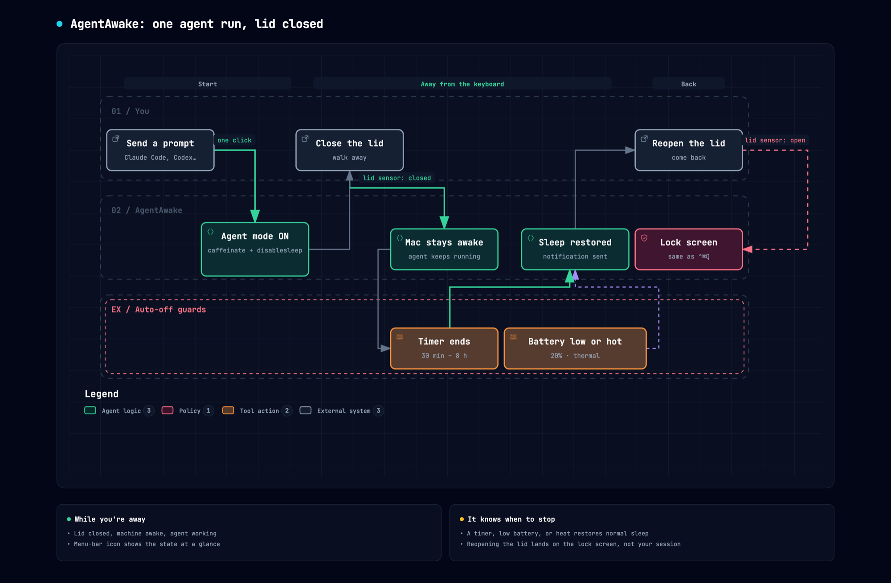

# AgentAwake

A tiny macOS menu-bar app for people who run coding agents. Close the lid, walk away, and the agent keeps working. Open the lid and you get the lock screen, not your unlocked session. When the agent finishes, the battery runs low, or the machine gets hot, normal sleep comes back on its own.

One Swift file, no dependencies, MIT licensed.



<sub>Interactive version: open <code>docs/agentawake.html</code> locally.</sub>

## Why

Claude Code, Codex, and friends run for twenty minutes at a time now. A MacBook with the lid closed goes to sleep and kills the job. The usual fix is `pmset disablesleep`, which has two problems: macOS then never shows the lock screen when you reopen the lid, and nothing ever turns it back off, so the laptop cooks in your bag. AgentAwake wraps the setting with the guards it should have had.

## Features

- **Stay awake** — runs `caffeinate -ims` so the machine, display, and disk don't idle-sleep.
- **Awake with lid closed** — sets `pmset disablesleep 1` so closing the lid doesn't sleep the machine.
- **Lock screen when lid reopens** — watches the lid sensor and locks the screen the moment you reopen it. Type your password and everything is still running.
- **Agent mode** — turns all of the above on in one click. **Everything OFF** restores normal sleep.
- **Timer** — awake for 30 minutes to 8 hours, then everything off.
- **Auto-off guards** — restore normal sleep and send a notification when:
  - the battery drops below 20%
  - the machine hits serious thermal pressure with the lid closed
  - the power cable is unplugged (off by default)
- **Launch at login**, **Check for updates**, optional **Restore sleep on quit**.
- **Optional, off by default:** stop when a watched agent process exits, and `agentawake://on|off|lock` URLs for harnesses that have lifecycle hooks. Neither is needed for normal use.
- Menu-bar icon shows state at a glance: ☕️ caffeinated, 🔒 lid-closed awake, 😴 normal.

## Install

Download `AgentAwake.zip` from the [latest release](https://github.com/s04/agent-awake/releases/latest), unzip, and drag to Applications. Builds are not yet notarized, so on first launch right-click the app and choose **Open**.

Or build from source. Needs Xcode command line tools and macOS 13 or later:

```sh
git clone https://github.com/s04/agent-awake && cd agent-awake
bash build.sh        # builds, ad-hoc signs, installs to ~/Applications, and launches
```

## Optional: hook it to your agent

You don't need this. Agent mode plus a timer or the battery and heat guards covers the normal case, and every harness has different hooks. If yours has them, the URL scheme is there. Claude Code example, in `~/.claude/settings.json`:

```json
{
  "hooks": {
    "UserPromptSubmit": [{ "hooks": [{ "type": "command", "command": "open -g agentawake://on" }] }],
    "Stop":             [{ "hooks": [{ "type": "command", "command": "open -g agentawake://off" }] }]
  }
}
```

Enable the passwordless toggle first (next section), or `on` will prompt for your password every time. The `-g` keeps the app from stealing focus. **Auto-off ▸ When agent exits** does the same thing without hooks by watching for named processes such as `claude` or `codex`, also off by default.

## Passwordless sleep toggle

Changing the lid-closed setting needs admin rights. By default AgentAwake asks for your password each time. That's fine at the keyboard and useless when a guard fires while the laptop is in a bag.

**Auto-off ▸ Allow sleep toggle without password…** installs a one-line sudoers rule that permits exactly two commands, `pmset -a disablesleep 0` and `pmset -a disablesleep 1`, and nothing else. It's validated with `visudo` before install and lives in `/etc/sudoers.d/agentawake`. Click the same menu item again to remove it.

## Security notes

Read these before trusting the app with a closed laptop.

- **The lid-closed setting is system-wide and outlives the app.** If you quit without turning it off, the machine still won't sleep. Turn on **Restore sleep on quit**, or run `sudo pmset -a disablesleep 0` to fix it by hand.
- **Heat.** A lid-closed laptop with sleep disabled runs at full power. The thermal guard reacts to the OS thermal state, which is a late signal. Don't rely on it as your only protection; set a timer as well.
- **The sudoers rule** lets any process running as your user flip the sleep setting without a password. It cannot run anything else. Remove it if that bothers you.
- **The URL scheme** can be triggered by any app or web page. Browsers ask before opening a custom scheme, but a local script could toggle sleep or lock your screen. Neither action is destructive.
- **Lock-on-reopen** uses the same private system call as ⌃⌘Q. If a future macOS removes it, the app falls back to display sleep, which locks if "Require password after display is turned off" is set in Lock Screen settings.
- **Unsigned builds.** There's no Apple Developer ID behind the releases yet, so Gatekeeper will warn on first launch. Build from source if you'd rather not trust a binary.

## Release

Push a tag and GitHub Actions builds and attaches the zip:

```sh
git tag v1.2.0 && git push origin v1.2.0
```

To ship signed builds, set `SIGN_IDENTITY` to a Developer ID and `NOTARY_PROFILE` to a `notarytool` keychain profile. See the comments in `build.sh`.

## Contributing

Issues and pull requests welcome. The whole app is `main.swift`; keep it that way if you can.
